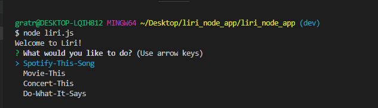
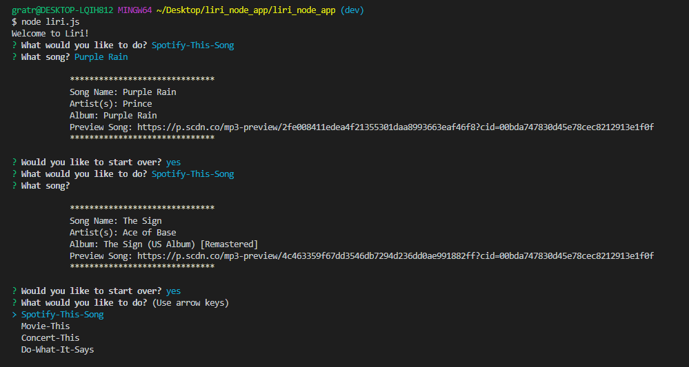
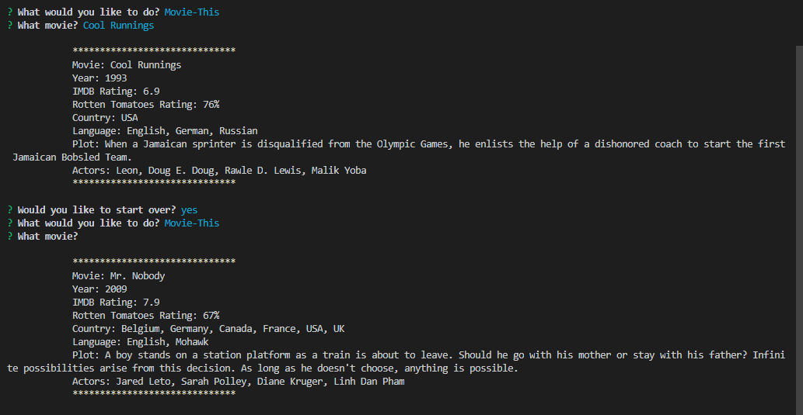
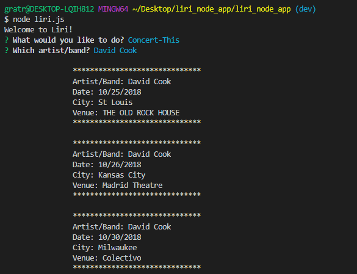
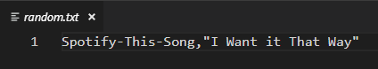
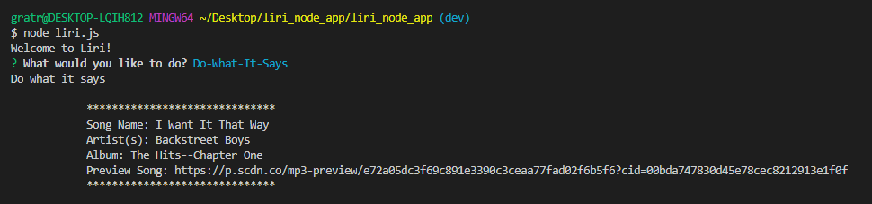
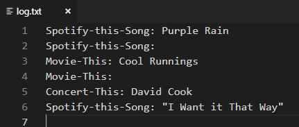
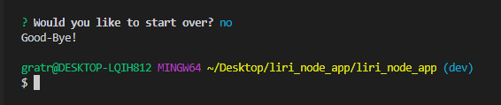

# Liri Node App

Welcome to my Liri Node App. LIRI is like iPhone's SIRI. However, while SIRI is a Speech Interpretation and Recognition Interface, LIRI is a _Language_ Interpretation and Recognition Interface. LIRI will be a command line node app that takes in parameters and gives you back data.
LIRI will search Spotify for songs, Bands in Town for concerts, and OMDB for movies.

My app begins by welcoming you to Liri and then gives you four options of what you would like to do.  

## Spotify-This-Song
_________________________
The first option is Spotify-This-Song.  For Spotify-This-Song, the user enters the song of their choice.  Here I chose 'Purple Rain'.  The song name, artist, album and link to preview the song are then displayed.  If no song is entered, the default song displayed is 'The Sign' by Ace of Base.  Also, notice after the results are displayed you are given the option to start over.  If you choose yes, the four options are again available to choose from.

## Movie-This
_________________________
The second option is Movie-This.  For Movie-This, the user enters the movie of their choice.  Here I chose 'Cool Runnings'.  The movie title, year, IMBD rating, Rotten Tomatoes rating, country produced, language, plot and actors are then displayed.  If no movie is entered, the default movie displayed is 'Mr. Nobody'.  

## Concert-This
_________________________
The third option is Concert-This.  For Concert-This, the user enters an artist or band of their choice.  Here I chose 'David Cook'.  The artist, concert date, city and venue are then displayed for three concerts.  

## Do-What-It-Says
_________________________
The fourth option is Do-What-It-Says.  For Do-What-It-Says, it reads from the random.txt file and then performs the operation in there. 

_________________________
Each search is recorded in a log.txt file.

Finally, if you choose no when asked if you want to start over, the program says "Good-bye" and ends.

